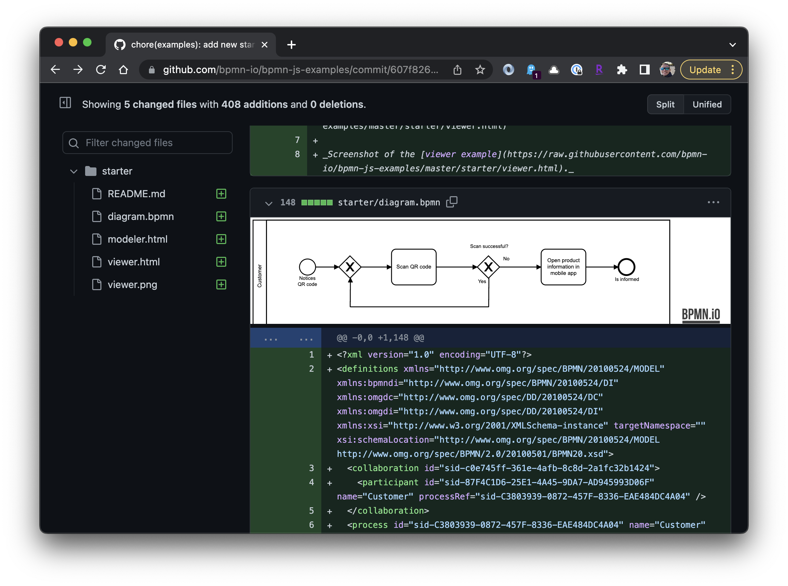

# Github BPMN Viewer Chrome Extension

This Chrome extension adds an inline BPMN viewer to Github PR and commit pages. File pages are not yet supported.

Samples Github pages to test this plugin on:

- [Example Commit page](https://github.com/bpmn-io/bpmn-js-examples/commit/607f826eb1e18649b2bdc527c3c08ef47a19f20f)
- [Example PR page](https://github.com/bpmn-io/bpmn-js/commit/12a10902ba52b60488d5ddf77b845679df21e656)

## This extension consists of the following parts

* Content script that detects .bpmn files in Github pages
* BPMN viewer that displays BPMN files

_The `./manifest.json` file describing its configuration._

## Possible improvements

* Currently displays only the new version of the `.bpmn` file, even if the file has been updated. This plugin needs to display a visual diff when the file has been updated.
* Add support for the Github file blob page

## Environment

* Node.js >=12.0.0
* NPM >= 6.0.0

## Testing

`Jest` is included and ready for the vanilla TS parts. Testing for React/Vue is not included in order to keep the Jest config clean.

## Scripts

* `npm run dist` - build the extension into `./dist` folder
* `npm run lint` - ESLint for `.ts` and `.tsx` files
* `npm run test` - Jest unit tests

## References

* Used scaffolding from https://github.com/room-js/chrome-extension-ts-starter
* Used the BPMN.io JS library https://bpmn.io/
